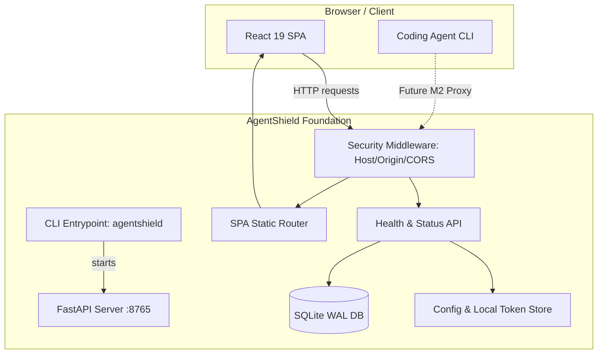

# Requirements

### Overview & Goals

The objective of Milestone 1 – Foundation is to establish the core software foundation for AgentShield, a local security reverse proxy that inspects and controls coding-agent traffic (OpenAI and Anthropic protocols). Milestone 1 bootstraps the monorepo, backend, frontend, local persistence, configuration system, security middleware, health endpoints, CLI entry points, and automated quality gates without implementing proxying or LLM-specific interceptors (which belong to Milestones 2+).

### Scope

#### In Scope (Milestone 1)
- **Monorepo & Toolchain**: Dual package setup (`backend/` with Python 3.14/`uv` and `frontend/` with React 19/TypeScript/Vite/`pnpm`).
- **Secure Configuration & Environment**: Platform-aware local data directory resolution (`~/Library/Application Support/AgentShield` on macOS, XDG on Linux, `%APPDATA%` on Windows), environment variable overrides, and local secret management.
- **Local Token Authentication**: Generation and storage of separate administrative tokens for the management API and proxy API with 0600 file permissions.
- **Security Middleware**: Strict loopback binding (`127.0.0.1`), `Host` header validation, `Origin` header validation, loopback-only CORS (no wildcard CORS), and RFC 7807 Problem Details error handling for the management API.
- **Persistence Layer**: SQLite with SQLAlchemy 2, WAL mode, foreign keys, busy timeouts, and an Alembic migration environment with baseline schema tables.
- **Management API & Health Endpoints**: `/health` (liveness), `/api/v1/status` (readiness and system info without leaking credentials).
- **CLI Commands**: CLI entry points for `agentshield start` and baseline `agentshield doctor`.
- **Frontend Scaffold**: React 19 SPA with TypeScript strict mode, Vite, TanStack Query, accessible application shell, and static asset serving from FastAPI.
- **Quality Gates & CI**: Ruff linting/formatting, Pyright strict mode, ESLint, Vitest, and pytest test suite.

#### Out of Scope (Deferred to Future Milestones)
- Milestone 2: OpenAI / Anthropic proxy endpoints, HTTP forwarding, upstream authentication, mock provider server.
- Milestone 3: Detectors (secrets, PII, custom terms), policy engine, request scanning.
- Milestone 4: SSE streaming scan, reversible pseudonymization, rehydration.
- Milestone 5: Full dashboard UI, approvals lifecycle, Monaco diff viewer.
- Milestone 6: Privacy-preserving audit export, Codex and Claude Code configuration adapters.
- Milestone 7: Hardening, attack corpus, packaging.

### User Stories

- **As a developer**, I want to start AgentShield locally via `agentshield start` so that the management API and dashboard UI are accessible at `http://127.0.0.1:8765`.
- **As a developer**, I want the service to bind strictly to loopback and validate `Host` and `Origin` headers so that unauthorized websites or network peers cannot access my proxy or management endpoints.
- **As a developer**, I want an automated test suite, strict type checking, and linters so that regression prevention and security invariants are enforced continuously.

### Functional Requirements

1. **CLI Execution**: Running `agentshield start` launches the FastAPI server and serves the built React frontend on `127.0.0.1:8765` by default. Port collision must fail with a clear diagnostic message or cleanly select a configured port.
2. **Health & Status API**:
   - `GET /health` returns HTTP 200 `{"status": "ok"}` for liveness checks.
   - `GET /api/v1/status` returns system information: version, database migration status, platform, active profile name, and port binding. Never expose stored secrets or upstream credentials.
3. **Database Initialization & Migrations**: On startup, SQLite initializes at the configured data directory in WAL mode, applies any pending Alembic migrations, and creates tables for settings, policies, integrations, and audit records.
4. **Token Generation**: On first launch, generate high-entropy administrative and proxy tokens stored locally in restricted-permission files (`0600`).
5. **Static Frontend Delivery**: In production mode, the FastAPI backend mounts and serves the static build output from `frontend/dist/` at the root URL path (`/`).

### Non-Functional & Security Requirements

- **Local-Only Binding**: Default binding to `127.0.0.1` (never `0.0.0.0`).
- **No Cloud Dependencies**: Everything operates completely offline with local dependencies and committed lockfiles (`uv.lock`, `pnpm-lock.yaml`).
- **Safe Logging & No Credential Leaks**: Implement a safe logging abstraction preventing raw credentials or `repr()` dumps from appearing in log streams or console output.
- **Strict Quality Gates**: Backend code must pass `pyright` in strict mode with zero errors and `ruff check`/`ruff format --check`. Frontend must pass `tsc --noEmit` and ESLint with zero errors.

# Technical Design

### Current Implementation & Architecture

The repository currently contains the specification documents in `planning/`, review documents in `review/`, and an initial placeholder `pyproject.toml`. No application code exists yet in `backend/` or `frontend/`.

Milestone 1 establishes the foundational architecture based on **ADR 0001 (FastAPI backend)**, **ADR 0002 (React/Vite frontend)**, and **ADR 0004 (SQLite persistence)**.

### Key Decisions

1. **Monorepo Layout**: Use `backend/` and `frontend/` subdirectories with dedicated toolchains (`uv` for Python and `pnpm` for Node/TypeScript) to keep dependencies isolated while sharing documentation and CI pipelines.
2. **Backend Domain Isolation**: Keep core domain abstractions, configuration, and security models independent of FastAPI to ensure testability and portability.
3. **Loopback & Same-Origin Security Model**: Serve the compiled React SPA directly from the FastAPI backend in production to eliminate cross-origin complexity while strictly validating `Host` and `Origin` headers. In development, restrict Vite CORS strictly to `http://127.0.0.1:5173`.
4. **SQLite Configuration**: Use SQLAlchemy 2 with synchronous or async engine utilizing WAL mode, 5000ms busy timeout, and explicit transactional boundaries. Restrict database file permissions to `0600`.
5. **Safe Logging Layer**: Centralized logger wrapper that sanitizes structured arguments and prohibits passing arbitrary raw payloads.

### Components & Modules Design

```text
agentshield/
├── backend/
│   ├── pyproject.toml
│   ├── uv.lock
│   ├── migrations/
│   │   ├── alembic.ini
│   │   ├── env.py
│   │   └── versions/
│   │       └── 0001_baseline_schema.py
│   ├── src/agentshield/
│   │   ├── __init__.py
│   │   ├── main.py                   # FastAPI entrypoint & app factory
│   │   ├── cli.py                    # Click/Typer CLI entrypoint
│   │   ├── core/
│   │   │   ├── config.py             # Pydantic BaseSettings & path resolution
│   │   │   ├── auth.py               # Local token generation & validation
│   │   │   ├── errors.py             # RFC 7807 Problem Details & handlers
│   │   │   └── logging.py            # Sanitized structured logging
│   │   ├── api/
│   │   │   ├── dependencies.py       # Auth & DB dependencies
│   │   │   ├── middleware.py         # Host/Origin & Security headers
│   │   │   └── routes/
│   │   │       ├── health.py         # /health & /status endpoints
│   │   │       └── static.py         # Static SPA mounting
│   │   └── persistence/
│   │       ├── db.py                 # Engine, sessionmaker, WAL config
│   │       ├── models.py             # SQLAlchemy 2 declarative models
│   │       └── repository.py         # Settings & policy persistence
│   └── tests/
│       ├── conftest.py
│       ├── test_config.py
│       ├── test_security_middleware.py
│       ├── test_persistence.py
│       └── test_health_api.py
├── frontend/
│   ├── package.json
│   ├── pnpm-lock.yaml
│   ├── vite.config.ts
│   ├── tsconfig.json
│   ├── src/
│   │   ├── main.tsx
│   │   ├── App.tsx
│   │   ├── api/                      # Query hooks and status fetcher
│   │   ├── components/               # Layout, Navigation, StatusBanner
│   │   └── pages/                    # Placeholder tabs (Dashboard, Policies, etc.)
│   └── tests/
│       └── App.test.tsx
└── .github/workflows/
    └── ci.yml
```

### Database Schema (Baseline Migration `0001_baseline_schema.py`)

- `app_settings`: Key-value configuration overrides (key, value_json, updated_at).
- `security_policies`: Versioned policy configurations (id, name, profile, is_active, version, rules_json, created_at).
- `integration_configs`: Agent integration metadata (agent_type, status, last_backup_path, updated_at).
- `audit_events`: Base table for audit records (id, timestamp, request_id, agent, provider, model, action, rule_id, metadata_json).

### Architecture Diagram



### Risks & Mitigations

- **Risk: Port 8765 conflict on local machine.**  
  *Mitigation*: Check socket binding on startup; if occupied by another instance or foreign process, output a descriptive error with resolution options.
- **Risk: Python wheel availability for Python 3.14 on some platforms.**  
  *Mitigation*: Set `requires-python = ">=3.12"` in `pyproject.toml` to support current stable Python (3.12/3.13) while remaining fully forward-compatible with 3.14.
- **Risk: Credential leaks in exception traces or debug logs.**  
  *Mitigation*: Implement safe logging wrapper that filters standard secret patterns and excludes raw request/response objects from `repr` dumps.

# Testing

### Validation Approach

Milestone 1 validation ensures that the monorepo toolchain is functioning, all security invariants for loopback and headers are enforced, database migrations and WAL configuration execute cleanly, and the frontend builds and connects to the backend status API.

### Key Scenarios

1. **CLI Execution & Startup**:
   - `agentshield start --port 8765` starts the server and logs confirmation.
   - Starting a second instance on the same port terminates with a clean exit code and actionable error message.
2. **Health and Status Endpoints**:
   - `GET /health` returns HTTP 200 `{"status": "ok"}`.
   - `GET /api/v1/status` returns version, database migration state, platform, and active profile without administrative tokens or secrets.
3. **Security Middleware Validation**:
   - Requests with `Host: 127.0.0.1:8765` or `Host: localhost:8765` succeed.
   - Requests with foreign `Host: attacker.com` return HTTP 400 Bad Request.
   - Requests with foreign `Origin: http://evil.com` are rejected or denied CORS.
   - Loopback CORS for `http://127.0.0.1:5173` (Vite dev server) is accepted.
   - No `Access-Control-Allow-Origin: *` is ever returned.
4. **Database & Alembic Migrations**:
   - Starting with an empty database runs Alembic migrations cleanly.
   - Verify `PRAGMA journal_mode` equals `wal`.
   - Verify file permissions of the generated SQLite database and token files are `0600` on POSIX platforms.
5. **Frontend Build & Serving**:
   - `pnpm build` creates static production bundle in `frontend/dist/`.
   - Backend serves `index.html` at `GET /` and static assets under `/assets/`.

### Security & Invariant Tests

- **Secret Absence Test**: Inject synthetic test tokens into configuration and run test suite; verify no synthetic token appears in test logs, standard output, or database audit tables.
- **Safe Error Response Test**: Trigger unhandled errors; verify the management API returns RFC 7807 JSON without internal stack traces or environment variables.

### Verification Commands

```bash

# Backend Quality Gates

cd backend
uv sync
uv run ruff check .
uv run ruff format --check .
uv run pyright
uv run pytest -v

# Frontend Quality Gates

cd frontend
pnpm install --frozen-lockfile
pnpm lint
pnpm typecheck
pnpm test
pnpm build
```

# Assumptions & Open Questions

### Documented Assumptions

1. **Python Environment**: `pyproject.toml` targets Python `>=3.12` to ensure broad platform compatibility while adhering to Python 3.14 design patterns.
2. **Filesystem Permissions**: On POSIX systems (macOS/Linux), configuration and token files are created with `0600` permissions. On Windows, standard user profile access control applies.
3. **Frontend Bundle**: In production mode, the React frontend is pre-built via Vite into `frontend/dist/` and mounted statically by FastAPI. In development mode, Vite runs on `http://127.0.0.1:5173` with proxy/CORS enabled for the backend.
4. **Local Data Directory**: Defaults to standard platform application directories (`~/Library/Application Support/AgentShield` on macOS, `~/.local/share/agentshield` on Linux, `%APPDATA%/AgentShield` on Windows), overridable via `AGENTSHIELD_DATA_DIR`.

### Open Questions & Deferred Architectural Items (From Review)

The following items from the technical review (`review/PLANNING_REVIEW.md`) do not block Milestone 1 but will be resolved in dedicated ADRs prior to later milestones:

1. **Session & Conversation Identity (ADR 0006)**: To be resolved before Milestone 4 (Streaming & Rehydration) to ensure cross-turn pseudonym consistency across multi-turn agent sessions.
2. **Agent Authentication Modes (ADR 0007)**: To be resolved before Milestone 2/6 to formalize OAuth/subscription passthrough mode vs. API-key substitution for Codex and Claude Code.
3. **Secrets Scanner Engine (ADR 0008)**: To be decided before Milestone 3 (Detectors & Policies) regarding wrapping an established engine vs. bespoke regex detectors.

# Delivery Steps

### ✓ Step 1: Monorepo Toolchain & Directory Scaffold
The monorepo structure is established with isolated backend and frontend toolchains, pinned dependencies, strict linting, and type checking configurations.

- Create `backend/` directory with `pyproject.toml`, configuring Python 3.14 (compatible with >=3.12), `uv` package management, dependencies (`fastapi`, `uvicorn`, `pydantic`, `pydantic-settings`, `sqlalchemy`, `alembic`, `httpx`, `click`/`typer`, `cryptography`), and dev dependencies (`ruff`, `pyright`, `pytest`, `pytest-asyncio`).
- Configure `pyproject.toml` tool sections for Ruff (linting and formatting) and Pyright in strict mode (`typeCheckingMode = "strict"`).
- Create `frontend/` directory with `package.json`, configuring React 19, TypeScript (strict mode), Vite, `@tanstack/react-query`, and development tools (ESLint, Prettier/Biome, Vitest).
- Create root and subproject configuration files (`.gitignore`, `.editorconfig`, CI workflow `.github/workflows/ci.yml`).

### ✓ Step 2: Configuration, Security Middleware & Safe Logging
Configuration management, local authentication tokens, safe logging, and security middleware are implemented to protect loopback boundaries.

- Implement `agentshield.core.config`: Pydantic BaseSettings class loading environment variables and platform-specific data directories (`~/Library/Application Support/AgentShield` on macOS, XDG on Linux, `%APPDATA%` on Windows, or `AGENTSHIELD_DATA_DIR`).
- Implement `agentshield.core.auth`: Cryptographic local administration and proxy token generation and storage in the protected data directory with 0600 file permissions.
- Implement `agentshield.core.logging`: Centralized safe logging utility ensuring no `repr`, exception trace, or log statement leaks credentials or raw payload secrets.
- Implement security middleware in FastAPI: Strict `Host` header checking, strict `Origin` validation, loopback-only CORS (no wildcard CORS allowed), and RFC 7807 Problem Details exception handlers.

### ✓ Step 3: SQLite Persistence Layer & Alembic Migrations
SQLite database connection with WAL mode and Alembic database migration system are operational with initial schema tables.

- Configure SQLAlchemy 2 engine in `agentshield.persistence.db` with SQLite WAL mode (`PRAGMA journal_mode=WAL`), foreign key enforcement (`PRAGMA foreign_keys=ON`), busy timeout (5000ms), and 0600 file permission enforcement.
- Setup Alembic under `backend/migrations/` with `env.py` configured for both offline and online migrations with SQLAlchemy models.
- Create initial database models and baseline Alembic migration in `agentshield.persistence.models` for application settings, security profiles/rules, integration configurations, and audit events metadata.
- Implement repository/DAO abstractions isolating database models from FastAPI request handlers.

### ✓ Step 4: Backend API, Health Endpoints, CLI & Frontend Serving
FastAPI management server, health/status endpoints, CLI entry points, and static frontend production serving are fully functional.

- Create FastAPI application factory in `agentshield.api.app` mounting API routers and exception handlers.
- Implement `GET /health` (liveness check) and `GET /api/v1/status` (readiness & diagnostic status reporting version, database migration state, active profile, and loopback binding without exposing sensitive credentials).
- Implement CLI entry point `agentshield` in `agentshield.cli` using Click/Typer with `start` command (running Uvicorn on 127.0.0.1:8765) and baseline `doctor` command.
- Implement single-instance loopback port binding validation and static file hosting for the compiled React frontend `dist/` directory at the root URL path.

### ✓ Step 5: Frontend Shell & Status UI Scaffold
A clean, accessible React single-page application with dashboard navigation and backend health status integration is operational.

- Scaffold Vite React 19 application in `frontend/src/` with TypeScript in strict mode.
- Setup TanStack Query provider and API client fetching system health and status from `/api/v1/status`.
- Implement basic navigation shell with tabs for Dashboard, Live Traffic, Approvals, Policies, Integrations, Audit, and Settings.
- Implement connection status indicator, dark/light theme foundation, and error boundary handling.
- Verify frontend production build (`pnpm build`) emits static assets into `frontend/dist/` ready to be served by the backend.

### ✓ Step 6: Quality Gates, Security Invariant Verification & Baseline Tests
All unit tests, security invariant checks, linter checks, and type checks pass with 100% compliance on both backend and frontend.

- Write pytest unit and integration tests under `backend/tests/` covering configuration loading, token authentication, Host/Origin validation, CORS restriction, SQLite WAL mode, Alembic migrations, health/status endpoints, and log secret sanitization.
- Write Vitest tests under `frontend/tests/` verifying component rendering and status integration.
- Execute the full validation suite: `ruff check`, `ruff format --check`, `pyright`, `pytest`, `pnpm lint`, `pnpm typecheck`, `pnpm test`, and `pnpm build`.
- Verify absence of synthetic test credentials across all test logs and database outputs.