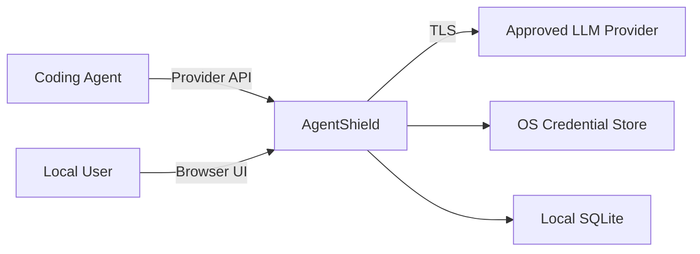
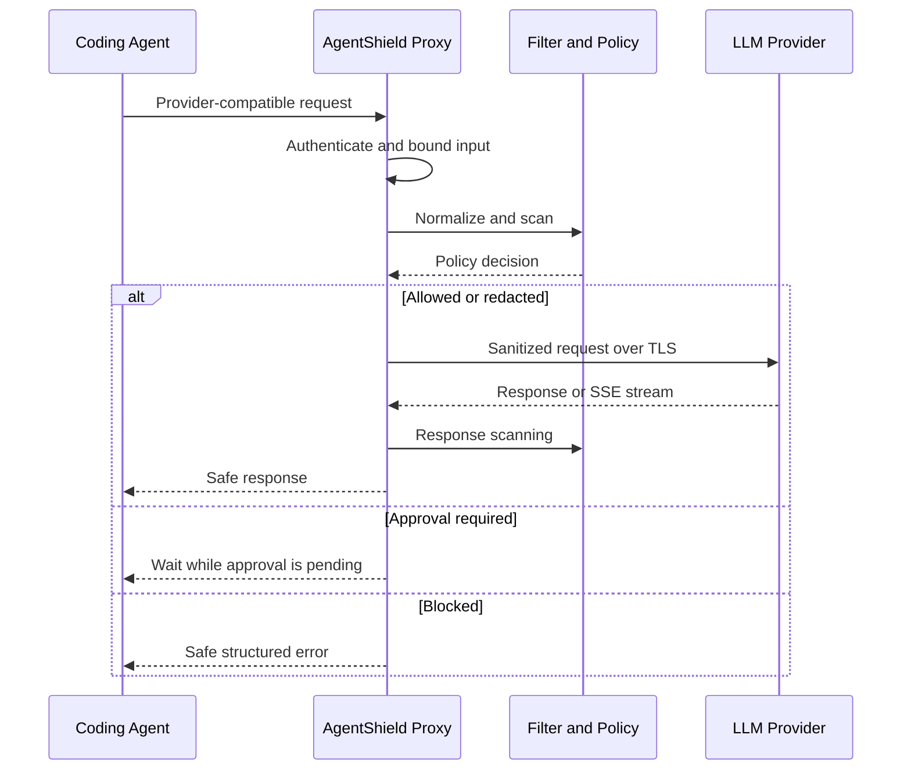

# AgentShield Architecture

Status: target architecture for Version 1  
Audience: implementers, reviewers, security engineers, and customer architects

## 1. Context

Coding agents can place prompts, source code, tool results, and credentials into calls to external LLM providers. AgentShield provides a local mediation boundary for traffic that the user explicitly routes through it.

The Version 1 architecture is a modular monolith with two logical planes:

- **Data plane:** latency-sensitive proxying, normalization, scanning, policy enforcement, redaction, rehydration, and streaming.
- **Control plane:** settings, policies, approvals, integrations, audit queries, exports, and UI delivery.

They initially run in one process but use separate modules, routes, credentials, and domain interfaces.

## 2. System Context



Only traffic through AgentShield is mediated. Direct coding-agent traffic to another endpoint is outside the Version 1 enforcement boundary.

## 3. Architectural Principles

1. **Honest boundary:** never claim control over bypass traffic.
2. **Secure by default:** secrets block; required checks fail closed in strict mode.
3. **Minimize retained data:** store decisions and fingerprints, not raw prompts.
4. **Deterministic enforcement:** detectors produce findings; policies decide actions.
5. **Protocol fidelity:** security processing must not casually change provider semantics.
6. **Bounded resources:** buffers, queues, request sizes, and approval waits have limits.
7. **Replaceable adapters:** provider, credential-store, persistence, and integration details stay behind interfaces.
8. **Local first:** no cloud component is required for Version 1.
9. **Test without external services:** local mock providers cover all automated tests.

## 4. Logical Components

### 4.1 Local Runtime

Owns process lifecycle, loopback binding, single-instance behavior, configuration loading, migrations, health checks, and static frontend delivery.

### 4.2 Proxy API

Exposes provider-compatible routes. It authenticates the local client, normalizes supported payloads, invokes the inspection pipeline, and forwards permitted traffic through a provider adapter.

### 4.3 Provider Adapters

OpenAI and Anthropic adapters own:

- upstream URL construction;
- endpoint validation before credential access;
- provider authentication;
- required headers;
- provider-specific error preservation;
- streaming event parsing and forwarding;
- cancellation propagation.

Adapters must not decide data-protection policy.

Production provider profiles accept only the documented provider hostname over
HTTPS on the default TLS port. Development mode additionally permits explicit
loopback HTTP or HTTPS endpoints for local mock providers. Endpoint URLs with
userinfo, query strings, fragments, or non-loopback custom hosts are rejected
before the native credential store is accessed.

### 4.4 Normalization Layer

Creates a provider-neutral `ScanContext` containing direction, provider, model, endpoint, selected headers, structured text locations, session information, and byte limits. It preserves sufficient location data to apply safe replacements to the original payload.

### 4.5 Detector Engine

Runs enabled detectors and returns `Finding` objects. Initial detector families are:

- credentials and secrets;
- PII;
- custom terms and regular expressions;
- unsupported content;
- response-side suspicious instructions where configured.

Detector failures are explicit inputs to the policy engine. They are never silently treated as “no findings.”

Milestone 3 runs request detectors in a stable order: built-in secrets,
structured PII, optional Presidio person/organization recognition, custom terms,
then unsupported content. Unexpected request headers are scanned by the secret
detector only; local authentication headers are handled separately and are never
placed in detector metadata. Blocking and redaction decisions complete before a
provider credential is read.

Findings retain category, severity, detector identity and version, confidence,
JSON path, half-open string offsets, safe display metadata, and a keyed
fingerprint. They do not retain detected text. Presidio and custom-term work is
offloaded from the async request loop. Detector timeouts and adapter failures
produce sanitized failure records for policy evaluation.

### 4.6 Policy Engine

Evaluates immutable policy versions against context, findings, detector health, and the selected profile. It returns one `PolicyDecision` using the documented action precedence.

For Milestone 3, the implemented precedence is `BLOCK > REDACT > WARN > ALLOW`.
Rules are ordered by action, explicit priority, and stable rule ID. The higher
security invariant means secret findings and required secret-detector failures
block in every profile, including audit. Audit otherwise forwards while
recording a hypothetical balanced decision. Balanced redacts PII, blocks
secrets, and follows custom-term defaults. Strict additionally blocks unsupported
or unknown custom content and required detector failures.

### 4.7 Redaction Service

Applies replacements using locations produced during normalization and scanning. It preserves JSON structure and validates the transformed payload before forwarding.

Redaction resolves overlaps by severity, category, confidence, and stable detector identity,
then replaces selected ranges from the end of each string toward the beginning.
For reversible categories (`PII_*`, `CUSTOM_TERM`), the service delegates to the
`PseudonymVault` scoped to the request's `session_id` to generate structured, collision-resistant
placeholders (`<AS:PREFIX:sess_hash:0001>`). Secret categories (`SECRET_*`) are irreversibly
replaced with fixed redaction markers (`[REDACTED_SECRET_...]`) and can never enter the vault.

### 4.8 Pseudonym Vault

Maintains collision-resistant mappings for reversible data classes. Version 1 implements
an in-memory vault (`InMemoryPseudonymVault`) with bounded TTL (default 3600 seconds) and
thread-safe access. Placeholders incorporate a truncated SHA-256 session hash and a per-category
sequence counter to ensure isolation across sessions and prevent collisions with input text.

The vault never accepts credentials or secret classes as reversible values (rejecting them with
`ValueError`). Rehydration resolves only exact issued placeholders for active sessions.

### 4.8.1 Streaming and Rehydration Pipeline

For streaming endpoints (`stream: true`), the proxy utilizes an incremental SSE parser
(`SSEParser`), a streaming rehydrator (`StreamingRehydrator`), and a streaming coordination
pipeline (`StreamingPipeline`). A rolling text holdback buffer (`TextStreamRehydrator`) buffers
potential placeholder prefixes across adjacent SSE delta chunks so that fragmented placeholders
are reassembled and rehydrated seamlessly. In addition, the pipeline runs rolling response scans
for secrets and credentials: if a secret or upstream credential leak is detected mid-stream,
the stream is immediately aborted to fail closed and prevent leakage.

### 4.9 Approval Coordinator

Creates one-time approval requests, notifies the UI, waits for a bounded decision, verifies request fingerprints, and handles denial, expiration, and client cancellation.

### 4.10 Audit Service

Records privacy-preserving event metadata after each decision and terminal outcome. It uses centralized safe serialization and must not receive raw provider credentials or unredacted secret values.

### 4.11 Integration Adapters

Inspect, preview, back up, modify, validate, and restore coding-agent configurations. Version 1 provides adapters for Codex and Claude Code. Format-specific logic must not leak into the rest of the application.

### 4.12 Management API and React UI

The management API exposes status, events, approvals, policies, detectors, settings, and exports.
The React UI unlocks with the local administration token, retains it only in page memory, and sends
it in an `Authorization` header for normal requests and Fetch-based SSE streaming. Management
credentials are never placed in URLs or durable browser storage. The UI consumes a generated
TypeScript client and is an operator interface, not an enforcement boundary.

## 5. Request Lifecycle



### 5.1 Mandatory Ordering

For outbound requests:

1. authenticate local proxy client;
2. apply header and size limits;
3. strictly parse and normalize supported payload, rejecting malformed JSON,
   duplicate keys, and unsupported streaming requests;
4. execute required detectors;
5. evaluate policy;
6. obtain approval where required;
7. apply and validate redaction;
8. obtain upstream credential from the native store;
9. call the provider;
10. record a sanitized audit outcome.

No request body bytes may be sent upstream before required outbound scanning and approval are complete.

The current non-streaming request normalizer scans supported prompt,
instruction, message, tool-argument/result, and tool-description strings. It
does not rewrite model names, roles, type discriminators, tool names, schema
constants, unknown root fields, or non-string JSON values. Supported multimodal
nodes become `unsupported_content` findings rather than being decoded or
scanned as text.

Non-streaming provider responses are consumed through a decoded-byte limit
before release to the client. Exact provider credentials found in any response
header or in the bounded response body cause a safe gateway failure. Fixed and
`Connection`-nominated hop-by-hop headers are removed in both directions.

### 5.2 Manual Approval Architecture (Milestone 5)

When request inspection matches a rule triggering `REQUIRE_APPROVAL`, the proxy pauses outbound transmission before contacting upstream providers:

1. **Precedence Hierarchy:** `BLOCK (50) > REQUIRE_APPROVAL (40) > REDACT (30) > WARN (20) > ALLOW (10)`. Secret findings always trigger `BLOCK` and can never be overridden by manual approval.
2. **In-Flight Hold Lifecycle:** The `ApprovalManager` creates a unique in-memory hold with bounded lifetime (`approval_timeout_seconds`, default 60s). Diffs and masked payloads are kept strictly in memory up to a bounded capacity (200 holds).
3. **Client Disconnect Detection:** While waiting for operator decision, a concurrent polling task monitors client socket state via `request.is_disconnected()`. If the client disconnects before approval, the hold transitions to `CANCELLED`, any pending future is released, and upstream transmission is aborted.
4. **Fail-Closed Expiration:** If the timeout expires without an operator decision, the hold transitions to `EXPIRED` and the proxy returns HTTP 403 `urn:agentshield:error:approval-timeout`. Upstream providers receive 0 bytes.
5. **Operator Decision Actions:** Authenticated operators approve or deny requests via `/api/v1/approvals/{id}/approve` or `/deny`. Denying returns HTTP 403 `urn:agentshield:error:approval-denied`.
6. **Real-Time SSE Broadcasting:** Management SSE subscribers receive `approval_pending` and `approval_decided` events via `/api/v1/events/stream` for immediate dashboard reactivity.
7. **Safe Diff Rendering:** Payloads presented in the React UI are rendered as inert plain text, displaying masked findings and diff comparisons without risk of script injection.

## 6. Streaming Architecture

Outbound request content is fully scanned before upstream transmission. Inbound SSE is processed event by event through a bounded parser and rolling scan window.

Key rules:

- never buffer an unbounded stream;
- preserve valid SSE framing and event order;
- propagate client cancellation upstream;
- bound rolling windows and per-event sizes;
- terminate the stream when an enforceable response finding is detected;
- record that content already delivered before a later finding cannot be recalled.

Response streaming has an inherent limitation: content released before a future malicious token cannot be retroactively removed. Strict response policies may therefore require a larger holdback window or non-streaming operation. This trade-off must be visible in configuration and documentation.

## 7. Authentication Model

AgentShield uses two local security contexts:

- **Proxy token:** configured in the coding agent and accepted only by proxy endpoints.
- **Management session/token:** accepted only by management endpoints and the UI.

Real upstream credentials remain in the native credential store. The proxy replaces local authentication with upstream authentication only after policy approval.

The backend binds to loopback and validates Host and Origin. Loopback binding is defense in depth, not authentication.

## 8. Persistence Model

SQLite is the Version 1 source of truth for:

- settings that are not secrets;
- policy definitions and immutable versions;
- detector configuration without secret values;
- sanitized audit events;
- approval metadata where necessary.

Provider credentials remain outside SQLite. Raw payload retention is disabled by default. Use Alembic for every schema change and enable WAL mode with explicit busy timeout and transaction handling.

Suggested primary entities:

- `policy`
- `policy_version`
- `detector_configuration`
- `audit_event`
- `approval_request`
- `integration_backup`

Do not store pseudonym mappings in ordinary audit tables.

## 9. Failure Semantics

| Failure | Default behavior |
| --- | --- |
| Secret found | Block |
| Required detector unavailable in strict mode | Block |
| Required detector unavailable in balanced mode | Configured warning or block; never silent |
| Credential store unavailable | Do not call provider |
| Policy store unavailable | Block protected requests |
| Audit store unavailable | Strict profile blocks; other profiles follow explicit configuration |
| Approval timeout | Block |
| Client disconnect during approval | Cancel |
| Client disconnect during provider stream | Cancel upstream |
| Provider response exceeds its decoded-byte limit | Terminate upstream and return a safe gateway error |
| Provider response contains the exact provider credential | Block the response and return a safe gateway error |
| Provider error | Preserve safe provider semantics |
| Malformed supported payload | Reject before provider call |

## 10. Extension Points

Define typed interfaces for:

- `Detector`
- `PolicyRepository`
- `AuditRepository`
- `CredentialStore`
- `ProviderAdapter`
- `AgentIntegration`
- `Clock`
- `IdGenerator`

Avoid a general plugin framework in early milestones. Stable internal interfaces are sufficient until a real external plugin use case exists.

## 11. Deployment Model

Version 1 runs as a local process:

```text
127.0.0.1:8765
```

### 11.1 Single-Worker Process Model
AgentShield Version 1 requires execution under a **single uvicorn worker process** (`workers=1`).
The following components rely on process-local in-memory state:
- In-flight approval hold queue (`ApprovalManager`);
- Pseudonymization memory vault (`InMemoryPseudonymVault`);
- Live SSE broadcast channel (`BroadcastManager`);
- Runtime settings modifications applied via the Management API.

Running multiple uvicorn worker processes without an external coordination bus (e.g., Redis) will cause approvals and SSE events to fail across workers. Version 1 is explicitly scoped as a single-user local proxy. Multi-worker scaling and external message buses are deferred to post-V1 milestones.

In development, Vite may use a separate loopback port. In the production build, FastAPI serves static frontend assets from the same origin.

Cross-platform distribution is initially source/CLI based. Tauri packaging and a hardened Rust sidecar are future architectural options, not Version 1 dependencies.

## 12. Observability

Expose local health, readiness, detector status, request counts, decisions, and latency metrics. Telemetry must use an allowlist of safe attributes. External telemetry exporters are disabled by default.

Correlation IDs must not encode user content. Content fingerprints should use a versioned normalization procedure and, where correlation resistance matters, a keyed digest rather than a plain reusable hash.

## 13. Architecture Fitness Checks

CI should verify:

- domain packages do not import FastAPI;
- frontend DTOs are generated rather than duplicated;
- network tests cannot reach public provider endpoints;
- logs and audit output exclude the synthetic secret corpus;
- streaming buffers remain bounded;
- migrations apply from an empty database;
- accepted ADRs and referenced documentation links exist.

## 14. Future Evolution

Potential later components include:

- controlled web-fetch gateway;
- MCP mediation;
- process sandbox and enforced egress;
- TLS interception under an explicitly managed trust model;
- Tauri desktop packaging;
- Rust data-plane sidecar;
- central team policy service;
- PostgreSQL and multi-user operation.

Each changes the threat model and requires a new or superseding ADR before implementation.
