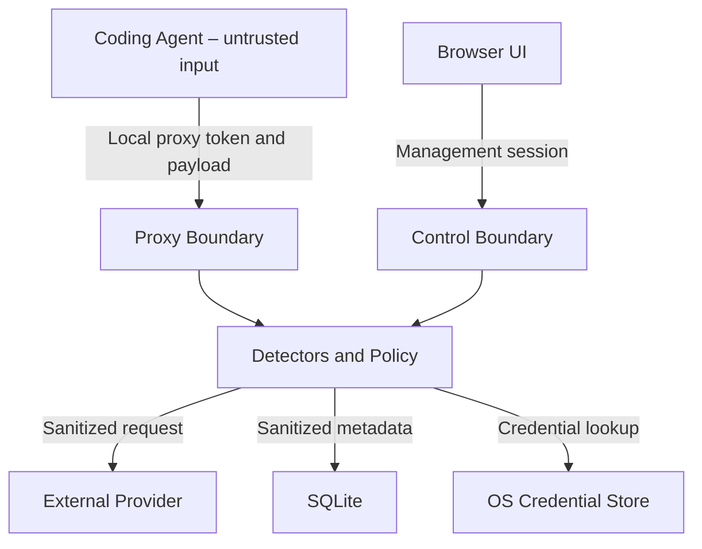

# AgentShield Threat Model

Status: Version 1 design baseline  
Review requirement: update whenever a trust boundary, data path, provider adapter, detector, storage mechanism, or integration changes

## 1. Purpose

This document identifies the security and privacy risks AgentShield Version 1 is designed to reduce, the controls it applies, and the risks that remain. It is deliberately explicit about limitations.

AgentShield Version 1 is a cooperative reverse proxy. It mediates traffic only when a coding agent is configured to use its endpoints.

## 2. Security Objectives

1. Prevent known credentials and configured confidential data from being sent through AgentShield to an external LLM provider.
2. Ensure local AgentShield credentials cannot become upstream provider credentials or leak to the provider.
3. Minimize retention of prompts, responses, detected values, and pseudonym mappings.
4. Make every enforcement decision attributable to a policy version and detector result without storing unnecessary content.
5. Preserve provider protocol behavior sufficiently that users do not bypass the proxy because it breaks normal agent operation.
6. State clearly when a risk cannot be controlled by Version 1.

## 3. Non-Objectives

Version 1 does not:

- prevent a process with unrestricted network access from bypassing AgentShield;
- defend a computer already controlled by an administrator-level attacker;
- make an untrusted coding agent safe to execute arbitrary commands;
- guarantee discovery of every secret, personal datum, or confidential concept;
- provide malware scanning for arbitrary binary files;
- establish legal or regulatory compliance by itself;
- provide multi-user authorization or remote administration;
- intercept arbitrary HTTPS connections.

## 4. Assets

| Asset | Security need |
| --- | --- |
| Provider API keys | Confidentiality and controlled use |
| Local proxy and management tokens | Confidentiality and separation of privilege |
| Source code and prompts | Confidentiality and integrity |
| PII and customer data | Confidentiality, minimization, retention control |
| Custom detection terms | Confidentiality and integrity |
| Policy definitions and versions | Integrity and traceability |
| Pseudonym mappings | Confidentiality, integrity, short lifetime |
| Audit events | Integrity, minimization, availability |
| Integration backups | Confidentiality and integrity |
| User approval decisions | Authenticity, freshness, and single use |

## 5. Actors

- **Local user:** configures and operates AgentShield.
- **Coding agent:** sends provider-compatible requests and consumes responses.
- **LLM provider:** receives sanitized requests and returns responses.
- **Malicious local webpage:** attempts to call loopback services through the user's browser.
- **Malicious or compromised local process:** attempts to call, bypass, or tamper with AgentShield.
- **Malicious prompt/content source:** places instructions or encoded data into content consumed by the agent.
- **Dependency or build-system attacker:** attempts supply-chain compromise.
- **Remote network attacker:** attempts interception or redirection of upstream traffic.

A local administrator-level attacker is outside the Version 1 trust model. A non-privileged local process is partially in scope; local tokens and origin checks must prevent trivial access, but Version 1 cannot provide strong isolation on a fully shared user account.

## 6. Trust Boundaries and Data Flows

Primary boundaries:

1. coding agent to proxy API;
2. browser to management API;
3. AgentShield to external provider;
4. runtime to native credential store;
5. runtime to SQLite and filesystem;
6. detector output to policy decision;
7. redacted content to reversible pseudonym mapping.

## 7. Threat Analysis

### T-01: Direct Proxy Bypass

**Scenario:** The coding agent uses `curl`, a subprocess, a different SDK, or a hard-coded provider endpoint and sends data without using AgentShield.

**Impact:** Complete loss of AgentShield inspection for that connection.

**Controls:**

- clear cooperative-proxy product boundary;
- configuration adapters and `agentshield doctor` checks;
- visible warning that direct egress is possible;
- no UI or documentation claim of transparent enforcement.

**Residual risk:** High. Strong prevention requires sandboxing, firewall enforcement, or process-level network controls in a later version.

### T-02: Localhost Request Forgery

**Scenario:** A malicious website or local process calls the management or proxy API on loopback.

**Impact:** Policy changes, approval forgery, audit access, or unauthorized provider use.

**Controls:**

- separate cryptographically random proxy and management credentials;
- strict Host and Origin validation;
- no wildcard CORS;
- state-changing requests require authentication;
- tokens never placed in URLs;
- same-origin frontend in production;
- loopback-only binding by default.

**Residual risk:** A compromised process running as the same OS user may be able to steal local credentials. Strong local process isolation is outside Version 1.

### T-03: Credential Disclosure to Provider

**Scenario:** AgentShield forwards its local proxy token, logs a provider key, or includes credentials in an upstream error.

**Impact:** Unauthorized provider usage and data exposure.

**Controls:**

- explicit header allowlist/denylist and hop-by-hop removal;
- replace local authentication only after enforcement;
- native credential store;
- validate the provider endpoint before reading its credential;
- block any upstream response header or bounded response body that contains the
  exact credential used for that request;
- centralized safe exception and logging serialization;
- tests that search logs, audit rows, API output, and DOM for synthetic credentials.

**Residual risk:** Implementation defects remain possible; credential paths require focused code review.

### T-04: Sensitive Payload Logging

**Scenario:** Framework access logs, validation errors, debug statements, tracing, or database errors retain raw prompts or responses.

**Impact:** A secondary durable disclosure channel.

**Controls:**

- raw payload logging disabled by design;
- safe logging API with allowlisted fields;
- no arbitrary provider exception serialization;
- redacted diagnostic mode with automatic expiry;
- telemetry exporters disabled by default;
- regression tests against a synthetic-secret corpus.

**Residual risk:** Third-party library logging must be configured and reviewed.

### T-05: Encoded or Obfuscated Secret Exfiltration

**Scenario:** A secret is Base64 encoded, URL encoded, split across fields, altered with zero-width characters, or placed in tool arguments.

**Impact:** A secret passes a naïve pattern scanner.

**Controls:**

- bounded normalization passes;
- recursive scanning of nested textual fields;
- context-aware entropy checks;
- encoding, Unicode, homoglyph, and fragmentation tests;
- strict handling of unsupported content.

Milestone 3 implements bounded ASCII URL decoding, zero-width removal with
original-offset mapping, and contextual Base64 decoding with a hard candidate
limit. It does not join values split across separate JSON nodes; that residual
case remains covered by the limitation below.

**Residual risk:** Arbitrary encryption or sophisticated steganography cannot be detected reliably. Strict deployments require enforced egress outside Version 1.

### T-06: False Negative in PII or Confidential-Term Detection

**Scenario:** A name, business concept, or source-code identifier is not recognized.

**Impact:** Confidential data reaches a provider.

**Controls:**

- combine pattern, NLP, and custom-term detectors;
- German and English test corpora;
- detector health visible in UI;
- project-specific rule import;
- strict profile can require manual approval for unsupported categories.

Structured email, telephone, IBAN, and optionally IP detection runs locally.
English and German person/organization results are normalized through a local
Microsoft Presidio adapter. Missing NLP models, initialization errors, and
timeouts are explicit detector failures; automated tests inject the adapter and
never download a model.

**Residual risk:** Material. Documentation must never promise complete semantic detection.

### T-07: False Positive or Destructive Redaction

**Scenario:** A detector alters ordinary code, syntax, or unrelated identifiers.

**Impact:** Broken prompts, incorrect patches, reduced trust, and proxy bypass by users.

**Controls:**

- detector confidence and explainable location;
- preview diff;
- policy by category and project;
- JSON-aware replacement;
- false-positive corpus;
- reversible mapping only for eligible categories.

Milestone 3 uses typed irreversible replacements and deterministic overlap
resolution. Reversible mapping and diff preview controls are introduced only in
their later milestones.

**Residual risk:** Users must be able to tune policies without disabling credential protection globally.

### T-08: Placeholder Injection or Collision

**Scenario:** Input already contains an AgentShield-looking placeholder, or an LLM invents one to cause unsafe rehydration.

**Impact:** Incorrect insertion of confidential values.

**Controls:**

- per-session cryptographic namespace or nonce;
- collision checks before issuing placeholders;
- exact replacement only for placeholders actually issued in the active mapping;
- category allowlist for rehydration;
- secrets never admitted to the reversible vault;
- TTL and session isolation.

**Residual risk:** Mapping compromise exposes reversible values during its lifetime.

### T-09: Approval Replay or Race

**Scenario:** An approval is reused for a modified request, arrives after timeout, or races with client cancellation.

**Impact:** Unapproved data is sent upstream.

**Controls:**

- one-time random approval ID;
- bind approval to request fingerprint and policy version;
- atomic terminal state transition;
- bounded expiry;
- no provider call after disconnect or expiry;
- concurrency and replay tests.

**Residual risk:** The local authorized user can deliberately approve unsafe content; that is an operator decision and must be audited.

### T-10: Policy Tampering or Downgrade

**Scenario:** A rule is changed, disabled, or reordered without traceability.

**Impact:** Weakened enforcement and misleading audit results.

**Controls:**

- immutable policy versions;
- audit each decision with policy version;
- authenticated management API;
- explicit rule precedence;
- atomic updates;
- show audit mode prominently.

**Residual risk:** A malicious process with the same user's filesystem access may alter local state. File permission hardening reduces but does not eliminate this risk.

### T-11: Malicious Provider Endpoint or SSRF

**Scenario:** Provider configuration points to loopback services, cloud metadata, private networks, or an attacker endpoint.

**Impact:** Credential disclosure or access to internal services.

**Controls:**

- production profiles accept only the predefined provider hostname over HTTPS
  on the default TLS port;
- validate the endpoint before accessing the native credential store;
- reject URL userinfo, query strings, fragments, link-local addresses, cloud
  metadata addresses, private addresses, and arbitrary custom hosts;
- disable redirect following for provider requests;
- development-mode exceptions are restricted to explicit loopback HTTP or HTTPS
  endpoints used by local mock providers.

**Residual risk:** A development-mode loopback provider receives the credential
for its configured provider profile. Development mode is an explicit local
testing boundary and must not be enabled for ordinary production use.

### T-12: TLS Interception or Provider Impersonation

**Scenario:** A network attacker presents an invalid certificate or redirects provider DNS.

**Impact:** Prompt and credential disclosure.

**Controls:**

- mandatory normal TLS certificate validation;
- no insecure mode;
- no arbitrary forwarding of provider credentials;
- optional future endpoint pinning only after separate design review.

**Residual risk:** Compromise of the OS trust store is outside the application boundary.

### T-13: Denial of Service and Resource Exhaustion

**Scenario:** Oversized JSON, decompression bombs, excessive concurrency, slow providers, or unbounded SSE events exhaust resources.

**Impact:** Proxy or workstation becomes unavailable.

**Controls:**

- hard encoded and decoded request limits;
- hard decoded non-streaming response limits;
- bounded queues, rolling buffers, event sizes, and approval waits;
- timeouts and cancellation propagation;
- concurrency limits;
- graceful rejection with safe errors.

**Residual risk:** Local users can still overload their own service; resource controls reduce blast radius.

### T-14: Streaming Disclosure Before Detection

**Scenario:** An inbound stream delivers benign content followed by content that later triggers a blocking response detector.

**Impact:** Earlier content has already reached the coding agent.

**Controls:**

- rolling holdback buffer;
- terminate on enforceable finding;
- configurable strict non-streaming or larger holdback for high-risk response policies;
- document that delivered tokens cannot be recalled.

**Residual risk:** Inherent to low-latency streaming. Version 1 must not claim atomic inspection of an entire streamed response.

### T-15: Parser Differential

**Scenario:** AgentShield and the provider interpret malformed or duplicate JSON fields differently.

**Impact:** Scanner inspects one semantic value while the provider processes another.

**Controls:**

- reject malformed JSON and ambiguous duplicate keys;
- use one parse representation for scanning and forwarding;
- serialize the validated transformed structure rather than combining parsed and raw fragments;
- contract and fuzz tests.

**Residual risk:** Provider-specific undocumented parsing differences require ongoing compatibility tests.

### T-16: Malicious LLM Response or Prompt Injection

**Scenario:** Provider output contains instructions designed to make the agent disclose data or execute unsafe tools.

**Impact:** Subsequent exfiltration or destructive agent behavior.

**Controls:**

- optional response findings and warnings;
- inspect tool calls contained in supported payloads;
- terminate streams on configured enforceable findings;
- future MCP and execution policies.

**Residual risk:** Version 1 is not a process sandbox and cannot enforce every action the coding agent takes.

### T-17: Cross-Session Pseudonym Leakage

**Scenario:** A placeholder mapping from one project or request is reused in another.

**Impact:** Disclosure or incorrect source transformation.

**Controls:**

- project/session-bound namespaces;
- TTL;
- concurrency isolation;
- mapping never included in audit;
- tests for simultaneous sessions.

**Residual risk:** Memory inspection by a same-user privileged process is outside Version 1.

### T-18: Unsafe Integration Modification

**Scenario:** AgentShield corrupts or over-writes Codex or Claude Code configuration, or backups expose secrets.

**Impact:** Tool outage, bypass, or credential disclosure.

**Controls:**

- preview, atomic write, minimal diff, restrictive permissions, validation, backup, and exact rollback;
- never copy provider credentials into agent configuration;
- version-aware integration adapters;
- tests with representative configuration fixtures.

**Residual risk:** Future agent configuration formats may change; unsupported formats must fail safely.

### T-19: Supply-Chain Compromise

**Scenario:** A dependency, build script, package, or release artifact is compromised.

**Impact:** Full compromise of prompts and provider credentials.

**Controls:**

- committed lockfiles;
- dependency review and vulnerability scanning;
- no unpinned remote CI scripts;
- SBOM;
- signed release artifacts in a later distribution milestone;
- minimize security-sensitive dependencies.

The Presidio analyzer and resolved NLP runtime are specification-required,
locked dependencies. Language models are separate local deployment inputs and
are not fetched automatically. ADR 0008 records why the initial secret scanner
uses focused built-in rules instead of another privileged scanning dependency.

**Residual risk:** Dependencies remain highly privileged and require continuous maintenance.

### T-20: Unsafe Diagnostic Mode

**Scenario:** A user enables diagnostics and forgets it, leaving payloads on disk.

**Impact:** Durable confidential-data exposure.

**Controls:**

- disabled by default;
- explicit warning and reason;
- short maximum TTL and automatic expiration;
- redaction still mandatory;
- visible active indicator;
- one-action cleanup.

**Residual risk:** Even redacted diagnostic data may be sensitive and must use restrictive permissions.

## 8. Security Assumptions

- The operating system and native credential store are patched and functioning correctly.
- The user account running AgentShield is not already compromised.
- Provider endpoint and credential configuration originates from an authorized local user.
- Provider data-processing terms are assessed outside AgentShield.
- The coding agent supports configuring a compatible base URL.

## 9. Verification Requirements

Before a Version 1 release:

- every threat above has at least one mapped test, documented manual control, or explicit accepted residual risk;
- the synthetic-secret corpus is searched across provider captures, logs, database rows, exports, API responses, and rendered UI;
- direct-egress limitations are visible in the README, UI, and demo;
- Host, Origin, token separation, approval replay, cancellation, decompression, and parser-differential tests pass;
- a reviewer confirms that no unsupported compliance or prevention claim is made.

## 10. Review Triggers

Review and version this threat model when adding:

- a provider;
- a new content type;
- persistent pseudonym mappings;
- a remote listener;
- external telemetry;
- internet fetch or forward proxying;
- MCP support;
- TLS interception;
- Tauri or a privileged helper;
- multi-user or centralized management;
- automated update or plugin installation.
